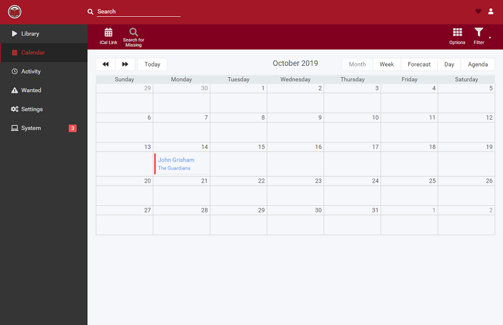

<!--
N.B.: This README was automatically generated by https://github.com/YunoHost/apps/tree/master/tools/README-generator
It shall NOT be edited by hand.
-->

# Readarr pour YunoHost

[](https://dash.yunohost.org/appci/app/readarr)  

[](https://install-app.yunohost.org/?app=readarr)

*[Read this readme in english.](./README.md)*

> *Ce package vous permet d’installer Readarr rapidement et simplement sur un serveur YunoHost.
Si vous n’avez pas YunoHost, regardez [ici](https://yunohost.org/#/install) pour savoir comment l’installer et en profiter.*

## Vue d’ensemble

Readarr est un gestionnaire de collections de livres électroniques et de livres audio pour les utilisateurs Usenet et BitTorrent. Il peut surveiller plusieurs flux RSS pour les nouveaux livres de vos auteurs préférés et les récupérer, les trier et les renommer. Notez qu'un seul type d'un livre donné est pris en charge. Si vous souhaitez à la fois un livre audio et un livre électronique d'un livre donné, vous aurez besoin de plusieurs instances.


**Version incluse :** 0.3.6.2232~ynh1

## Captures d’écran



## Documentations et ressources

* Site officiel de l’app : <https://readarr.com/>
* Documentation officielle de l’admin : <https://wiki.servarr.com/readarr/installation/linux>
* Dépôt de code officiel de l’app : <https://github.com/Readarr/Readarr>
* Signaler un bug : <https://github.com/YunoHost-Apps/readarr_ynh/issues>

## Informations pour les développeurs

Merci de faire vos pull request sur la [branche testing](https://github.com/YunoHost-Apps/readarr_ynh/tree/testing).

Pour essayer la branche testing, procédez comme suit.

``` bash
sudo yunohost app install https://github.com/YunoHost-Apps/readarr_ynh/tree/testing --debug
ou
sudo yunohost app upgrade readarr -u https://github.com/YunoHost-Apps/readarr_ynh/tree/testing --debug
```

**Plus d’infos sur le packaging d’applications :** <https://yunohost.org/packaging_apps>