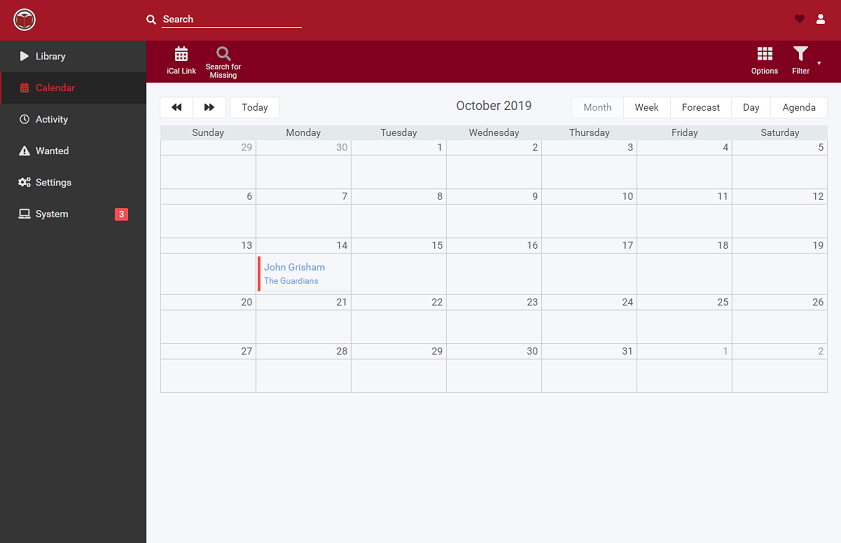

<!--
NOTA: Este README foi creado automáticamente por <https://github.com/YunoHost/apps/tree/master/tools/readme_generator>
NON debe editarse manualmente.
-->

# Readarr para YunoHost

[](https://ci-apps.yunohost.org/ci/apps/readarr/)  

[](https://install-app.yunohost.org/?app=readarr)

*[Le este README en outros idiomas.](./ALL_README.md)*

> *Este paquete permíteche instalar Readarr de xeito rápido e doado nun servidor YunoHost.*  
> *Se non usas YunoHost, le a [documentación](https://yunohost.org/install) para saber como instalalo.*

## Vista xeral

Readarr is an eBook and audiobook collection manager for Usenet and BitTorrent users. It can monitor multiple RSS feeds for new books and will interface with clients and indexers to grab, sort, and rename them. It can also be configured to automatically upgrade the quality of existing files in the library when a better quality format becomes available. It does not manage comics or magazines.

**Versión proporcionada:** 0.3.19.2437~ynh2

## Capturas de pantalla



## Documentación e recursos

- Web oficial da app: <https://readarr.com/>
- Documentación oficial para admin: <https://wiki.servarr.com/readarr/installation/linux>
- Repositorio de orixe do código: <https://github.com/Readarr/Readarr>
- Tenda YunoHost: <https://apps.yunohost.org/app/readarr>
- Informar dun problema: <https://github.com/YunoHost-Apps/readarr_ynh/issues>

## Info de desenvolvemento

Envía a túa colaboración á [rama `testing`](https://github.com/YunoHost-Apps/readarr_ynh/tree/testing).

Para probar a rama `testing`, procede deste xeito:

```bash
sudo yunohost app install https://github.com/YunoHost-Apps/readarr_ynh/tree/testing --debug
ou
sudo yunohost app upgrade readarr -u https://github.com/YunoHost-Apps/readarr_ynh/tree/testing --debug
```

**Máis info sobre o empaquetado da app:** <https://yunohost.org/packaging_apps>
